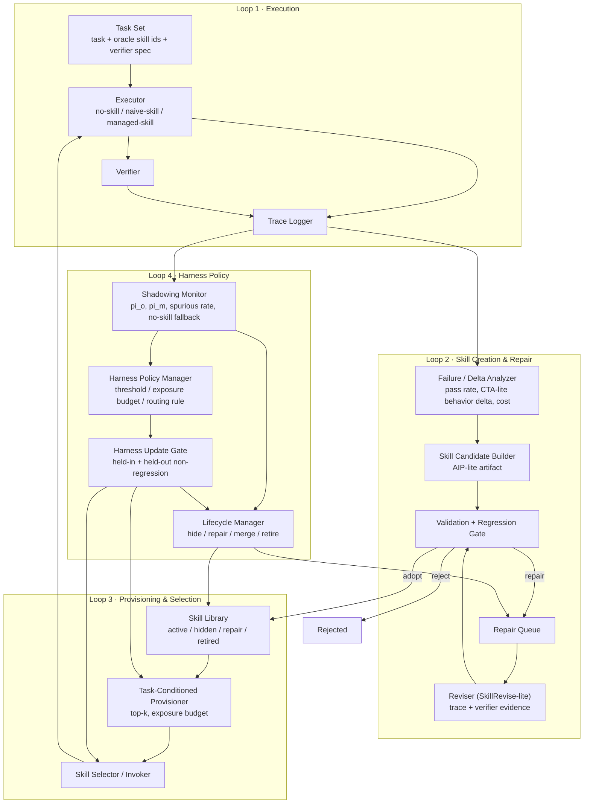

# Merlin MVP Architecture

Created: 2026-07-08

Merlin is not a skill text generator. It is a self-managing skill-harness agent: it governs skill generation, validation, provisioning, selection, behavior measurement, lifecycle, and bounded harness policy updates.

## Diagram



## The Four Loops

**Loop 1 — Execution.** Solve tasks and log traces. Every run records condition (`no_skill` / `naive_skill` / `managed_skill`), provisioned and selected skill ids, oracle skill ids, verifier result, cost, and latency. Modules: `executors.py`, `runner.py`, `tasks.py`, `traces.py`.

**Loop 2 — Skill creation & repair.** Build candidate skills from failure traces as AIP-lite artifacts (contract + steps + validators + provenance). Repair-queue skills re-enter through SkillRevise-lite: diagnose from trace and verifier evidence, revise, re-execute, select the first verifier-passing version. A generated skill starts as `candidate`, never `active`. Modules: `models.py`, `lifecycle.py` (gates), reviser is Phase 5.

**Loop 3 — Provisioning & selection.** Only active skills are exposed, top-k per task under an exposure budget, then selected/invoked by the executor. Modules: `provisioning.py`.

**Loop 4 — Harness policy.** The shadowing monitor computes selection-quality metrics from traces; the lifecycle manager moves skills between `active / hidden / repair / retired`; the policy manager proposes changes to narrow policy surfaces (exposure budget, retrieval weights, selector instruction, lifecycle/validation thresholds). Every policy change must pass the held-in + held-out non-regression gate before it touches the provisioner, selector, or lifecycle thresholds. Modules: `metrics.py`, `lifecycle.py`.

## HarnessX Runtime Path

The hook/processor substrate is in scope for the MVP because full harness
co-evolution is the long-term direction. Merlin needs typed harness control
points so library exposure, wrong invocation, lifecycle actions, and later
processor composition changes can be managed before they become repeated task
failures.

Implemented shape:

```text
Hook -> ordered List[Processor(name, config)] -> HarnessEvent
```

Current hooks:

```text
task_start
before_provision
after_provision
before_select
after_select
after_verify
trace_closed
policy_review
```

Current processor kinds:

```text
provisioning
selection_guard
monitor
lifecycle
policy
trace
```

Current processors:

- `SkillStateProcessor`: removes non-active or explicitly blocked skills before provisioning.
- `ExposureBudgetProcessor`: clamps exposed skill count through a policy surface.
- `DoNotUseConstraintProcessor`: removes provisioned skills whose contract says not to use them on the current task.
- `ShadowingMonitorProcessor`: annotates route events such as `oracle_only`, `wrong`, `mixed`, `spurious`, and `empty`.
- `ShadowingLifecycleProcessor`: turns repeated route-risk evidence into lifecycle decisions such as `hide`.

Current evolution contract:

```text
H_t
-> snapshot_harness_variant(H_t)
-> HarnessEvolutionProposal(H_t -> H_tilde)
-> isolated held-in / held-out evaluation
-> evaluate_harness_evolution
-> promote or reject H_tilde
```

The first implemented variant surface is processor composition plus narrow
policy values. Processor configs are included in the manifest so a candidate or
parent harness can be reconstructed for isolated evaluation and rollback. Later
phases can add processor generation, processor repair, variant isolation at
larger scale, and cross-harness evaluation.

This is currently a HarnessX-inspired hook-indexed processor scaffold, not a
full typed-hook contract: hook-specific event classes, allowed-mutation checks,
singleton/order/dependency constraints, and post-invocation validation remain
to be implemented. Variant manifests and gate schemas exist, but the gate still
needs to execute candidate smoke and paired regression evidence internally.
Model co-evolution,
cross-harness GRPO, and arbitrary code rewriting remain later research phases,
not rejected goals.

## Gate and Metric Definitions

Candidate gate (Loop 2): structure fail → reject; missing target/regression
evidence → repair; target or regression verifier fail → repair; adopt only when
both non-empty evidence sets pass. Executable validator resolution and
trace/evidence binding remain required before C3 claims.

Selection metrics (Loop 4), all over invocation records:

```text
pi_o   clean oracle invocation rate: selected != {} and selected ⊆ oracle,
       over tasks with oracle != {}
pi_m   shadowing rate: at least one distractor selected, over tasks with oracle != {}
spurious invocation rate: any skill selected, over tasks with oracle == {}
no-skill fallback: nothing selected, over tasks with oracle != {}
```

Skill utility (SkillsBench-style): `g = (p_skill - p_vanilla) / (1 - p_vanilla)`; when the baseline is saturated the raw delta is returned so regressions stay visible.

Harness update gate (Self-Harness-style): accept iff `Δ_in >= 0 and Δ_ho >= 0 and max(Δ_in, Δ_ho) > 0`.

## Deferred From First Executable Slice

Model-weight updates, RL, graph database, cross-harness GRPO, and arbitrary
code-level harness rewriting. Full HarnessX-style co-evolution is a required
long-term target for Merlin's harness growth claim, but it must be staged
through typed hooks, processor manifests, isolated variant evaluation, and
held-in/held-out gates.

## Status

Loops 1 and 4 metric formulas are implemented and tested (`tests/test_core.py`),
but actual invocation evidence is not yet wired; current selected-skill traces
must not be treated as More Skills invocation trajectories. Loop 3
provisioner is lexical top-k and now runs through HarnessX-inspired hooks in
`harness.py`. Harness variant snapshots and evolution-gate results are also
implemented as the bridge toward co-evolution. Loop 2 candidate builder and
reviser are Phase 4–5 work; the repair queue and gates already exist. See
`docs/mvp-work-breakdown.md`.
